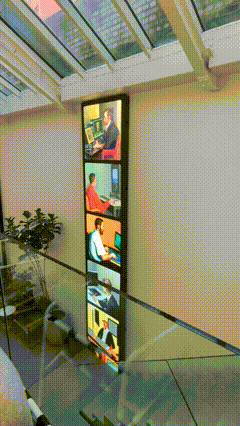

<h1 align="center">Folder Stack</h1>
<p align="center">
  A slick way to watch folders on big screens.
</p>

<p align="center">
  
</p>

This is a small [Next.js](https://nextjs.org/) fullstack app that allows you to specify a local folder of images (PNGs) to watch, and an accompanying frontend application displaying these images in a simple yet elegant vertical list.

## Getting Started

First, clone the repository and install the dependencies:

```bash
npm run i
```

Then, run the development server:

```bash
npm run dev
```

Open [http://localhost:3000](http://localhost:3000) with your browser to see the result.

## Configuration

You can configure a few things by editing the file `src/config/index.ts`.

- `ROOT_DIRECTORY` - The directory to watch. Can be absolute or relative to the project root.
- `RECURSIVE` - Should we scan recursively within folders.
- `MAX_IMAGES` - How many images to request.
- `POLL_INTERVAL` - How often should the frontend look for updates.
- `FILE_EXTENSIONS` - An array of filetypes supported, e.g. `["png", "jpg"]`.
- `SHOW_TITLE` - If the title should be overlaid.
- `DISABLE_SCROLL` - Should scrolling be blocked?
- `STACK_STYLE` - How the image stack should be transformed on the page using regular `CSSProperties`.
